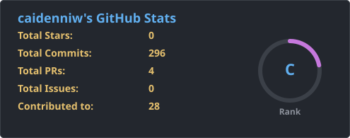
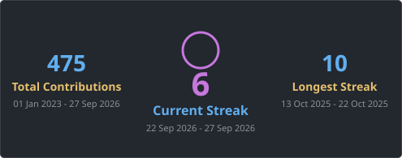
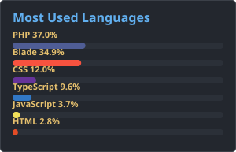
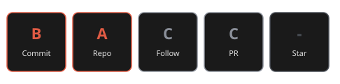

# 👋 Hi, I'm Deni Arya Winaldi

I'm a junior **Full Stack Developer** in progress, passionate about turning ideas into full-featured web applications.
I love exploring new technologies and growing through hands-on projects and continuous learning.

---

## 🧠 About Me
- 💻 Focused on **Full Stack Development**  
- 🧪 Actively learning **MEVN Stack** & exploring **Web3 technologies**  
- ⚡ Experienced in working on **school-based projects** and practical applications  
- 🛠️ Mostly code with **PHP (Laravel)**, but always eager to broaden my tech stack  
- 🎮 Tech tinkerer & gamer in my free time

---

## 🛠️ Tech Stack
- **Languages:** HTML, CSS, JavaScript, PHP  
- **Frameworks & Libraries:** Laravel, Vue.js (learning), Bootstrap  
- **Tools:** Git, GitHub, VS Code, Canva, Figma  

---

## 🌐 Let's Connect
- 📫 Email: [deni01arya02@gmail.com](mailto:deni01arya02@gmail.com)  

---

⭐ *“Code isn’t just about solving problems — it’s about creating something meaningful.”*  

## 🌐 Socials:

    

# 💻 Tech Stack:

           

# 📊 GitHub Stats:

## 🏆 GitHub Trophies

<picture>
  <source media="(prefers-color-scheme: dark)" srcset="https://raw.githubusercontent.com/caidenniw/caidenniw/output/pacman-contribution-graph-dark.svg">
  <source media="(prefers-color-scheme: light)" srcset="https://raw.githubusercontent.com/caidenniw/caidenniw/output/pacman-contribution-graph.svg">
  
</picture>

###

<!-- Proudly created with GPRM ( https://gprm.itsvg.in ) -->
